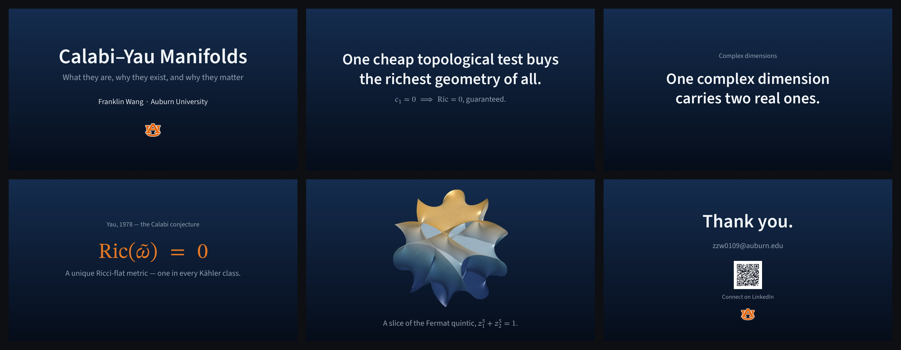

# beamer-keynote

<a href="../previews/hd/beamer-keynote.jpg"></a>

<p align="center"><a href="https://github.com/Franklinwang72/auburn-poster-templates/releases/latest/download/beamer-keynote.zip"></a></p>

## Use (Overleaf)

Upload this folder (New Project → Upload Project) → **Menu → Compiler → LuaLaTeX** → **Recompile**.

## Write your talk

`beamer-keynote.tex` is only your slides — the look lives in `beamerthemeAUkeynote.sty`. One idea per frame:

```latex
\begin{frame}[plain]
  \kicker{small gray line above}
  \statement{The one big sentence.}
  \substatement{a quiet afterthought}
\end{frame}
```

Also: `\bignum{101}{caption}` · `\heroimage{figures/…}` · `\bigequation{…}` · `\CYtitleframe` · `\CYclosingframe{qr-url}{qr-label}{contact}`. Title and author are set with the usual `\title`, `\subtitle`, `\author`.

> beamer cannot produce a tagged (PDF/UA) PDF; this deck is accessible by design instead — contrast, structure, bundled fonts.

## License

Theme code MIT · fonts SIL OFL 1.1 (`fonts/OFL-*.txt`) · the Auburn logo is a registered trademark — replace it if you are not affiliated with Auburn.
