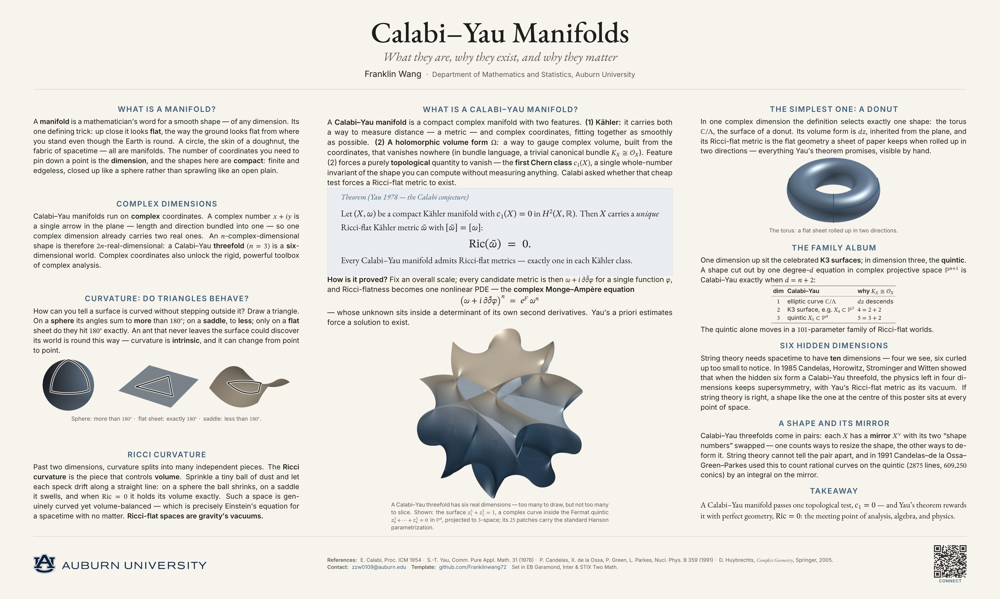

<h1 align="center">Calabi–Yau Manifolds — Auburn Research Poster</h1>

## Quick Start (Overleaf)

1. **Zip this whole folder** and, on [overleaf.com](https://www.overleaf.com),
   choose **New Project → Upload Project** and drop in the zip.
2. **Menu → Compiler → LuaLaTeX.** *(Required — the bundled fonts load through
   `fontspec`; the default pdfLaTeX will not work.)*
3. **Menu → Main document → `poster-one.tex`**, then click **Recompile**.

> **First compile is slow** — LuaLaTeX caches the bundled fonts, and the tagged
> PDF needs two passes. On a **free** Overleaf account it may time out the first
> time: just click **Recompile** once or twice more and it will finish. (If your
> department has an Overleaf **Commons** subscription, the longer timeout avoids
> this entirely.)

Building locally instead? Run `latexmk` (LuaLaTeX is required); `make clean`
removes the build files.

## What to edit

- **Title, author, department, URLs, QR link** — all live in the single
  `EDIT` block near the top of `poster-one.tex`. Nothing else needs touching to
  make it yours.
- **The three columns** are marked with `% ---------- LEFT / CENTER / RIGHT`
  comments. Replace the mathematics with your own.
- **If you add text and the PDF spills to a second page**, LuaLaTeX prints an
  `Overfull \vbox` warning and a loud one-page guard fires — trim a little, or
  raise `\BodyH` slightly (the fixed column height, in the body section).

## Replacing the figures

Drop a new image with the **same file name** into `figures/` — no code change
needed. The three figures were generated with the matching `figures/*.py`
scripts (Python + matplotlib + numpy); rerun them from the folder root to
regenerate. The scripts are for reproducibility only and are **not** needed to
compile on Overleaf.

## Licensing

See [`LICENSE.md`](LICENSE.md). In short: template code is MIT; the bundled
fonts are SIL OFL 1.1 (`fonts/OFL-*.txt`); the **Auburn University logo is a
registered trademark** — replace `auburn/…/auburn_formal_h_onecolor_blue_digital.png`
if you are not affiliated with Auburn.
