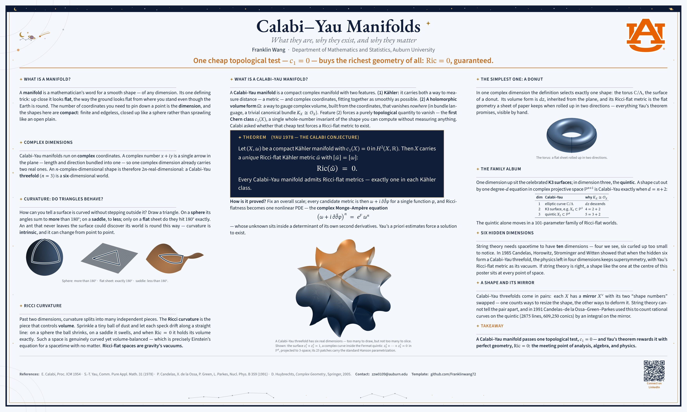

# poster-research-astronomy

## Use (Overleaf)

Upload this folder (New Project → Upload Project) → **Menu → Compiler → LuaLaTeX** → **Recompile**. First compile is slow; on a free account just recompile if it times out.

## Write your poster

`poster-research-astronomy.tex` is only your content — all styling lives in `postertheme.sty`.

1. Fill in `\PosterSetup{ title = {…}, authors = {…}, … }`.
2. Write into the three `postercolumn` blocks (`[wide]` = centre):
   `\section{…}`, `theorem` (with `\punchline{…}`), `definition`, `lemma`,
   `proposition`, `corollary`, `remark`, `example`, `proof` — all paste
   straight from a paper. `\vfill` between sections spreads them out.
3. References go inside `posterfooter`; the QR comes from `\PosterSetup`.

Figures: drop same-named files into `figures/`.

## License

Theme code MIT · fonts SIL OFL 1.1 (`fonts/OFL-*.txt`) · the Auburn logo is a registered trademark — replace it if you are not affiliated with Auburn.
