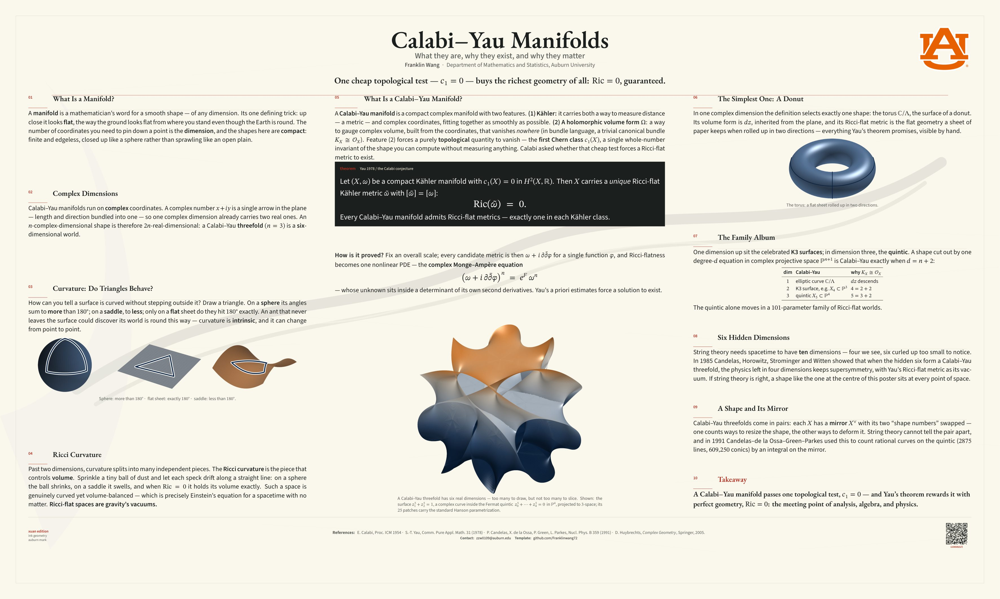

<h1 align="center">Research Poster — Auburn Calligraphy</h1>

## Quick Start (Overleaf)

1. **Zip this whole folder** and, on [overleaf.com](https://www.overleaf.com),
   choose **New Project → Upload Project** and drop in the zip.
2. **Menu → Compiler → LuaLaTeX.** *(Required — the bundled fonts load through
   `fontspec`; the default pdfLaTeX will not work.)*
3. **Menu → Main document → `poster-research-calligraphy.tex`**, then click **Recompile**.

> **First compile is slow** — LuaLaTeX caches the bundled fonts, and the tagged
> PDF needs two passes. On a **free** Overleaf account it may time out the first
> time: just click **Recompile** once or twice more and it will finish. (An
> Overleaf **Commons** subscription raises the timeout and avoids this.)

Building locally instead? Run `latexmk` (LuaLaTeX is required); `make clean`
removes the build files.

## What to edit

- **Title, author, department, URLs, QR link** — all live in the single
  `EDIT` block near the top of `poster-research-calligraphy.tex`.
- The three content columns follow; replace the mathematics with your own.
- Replace a figure by dropping a new file with the **same name** into
  `figures/` — the three figures were generated by `figures/make-figures.py`
  (Python + matplotlib), included for reproducibility only.

## Licensing

See [`LICENSE.md`](LICENSE.md). Template/theme code is MIT; bundled fonts are SIL
OFL 1.1 (`fonts/OFL-*.txt`); the **Auburn University logo (`AUlogo.png`) is a
registered trademark** — replace it if you are not affiliated with Auburn.
