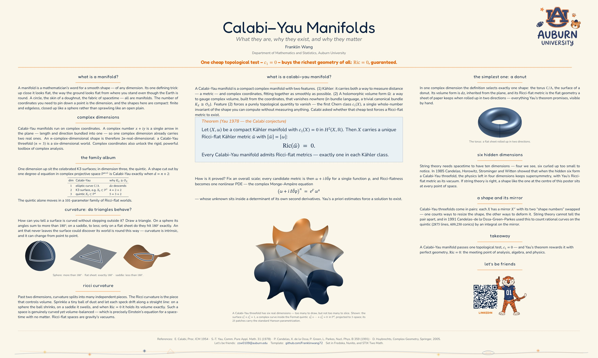

# Research Poster - Auburn Childlike Crayon Variant

<a href="../previews/hd/poster-research-childlike.jpg"></a>

<p align="center"><a href="https://github.com/Franklinwang72/auburn-poster-templates/releases/latest/download/poster-research-childlike.zip"></a></p>


This is the fourth Auburn research poster variant in the set. It keeps the
same Calabi--Yau content as the other posters, but shifts the visual language
toward a restrained childlike style: warm paper, Auburn navy/orange, the
hand-drawn AU logo, crayon section rules, and a small bottom doodle strip.

## Quick Start

1. Zip this whole folder and upload it to Overleaf.
2. Set **Menu -> Compiler -> LuaLaTeX**.
3. Set the main document to `poster-research-childlike.tex`.
4. Recompile. If the first compile is slow, recompile once more so LuaLaTeX can
   finish caching the bundled fonts.

Building locally instead:

```bash
latexmk
```

## Font Direction

The poster deliberately avoids system-only handwriting fonts so it remains
portable. The title and theorem use EB Garamond for a soft academic voice, the
body uses Inter for clean research-poster readability, and STIX Two Math keeps
the formulas consistent with the other variants. The childlike tone comes from
the supplied logo and the crayon-style Auburn blue/orange accents rather than
from making the body text playful.

## What to Edit

The title, author, department, links, QR target, and contact email live in the
single `EDIT` block near the top of `poster-research-childlike.tex`.

## Licensing

See `LICENSE.md`. Bundled fonts are under the SIL OFL; the Auburn logo is a
trademark asset and should be used only where appropriate.
