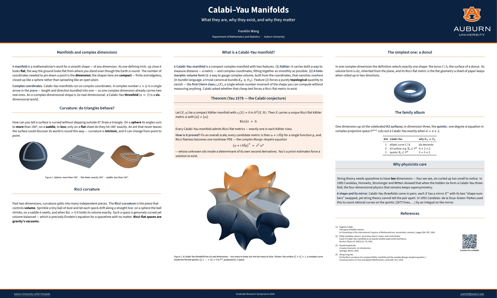

<h1 align="center">Research Poster — Auburn (Classic Three-Column)</h1>

## Quick Start (Overleaf)

1. **Zip this whole folder** and, on [overleaf.com](https://www.overleaf.com),
   choose **New Project → Upload Project** and drop in the zip.
2. **Menu → Compiler → LuaLaTeX.** *(Required — the bundled fonts load through
   `fontspec`; the default pdfLaTeX will not work.)*
3. **Menu → Main document → `poster-research-classic.tex`**, then click
   **Recompile**.

> **First compile is slow** — LuaLaTeX caches the bundled fonts. On a **free**
> Overleaf account it may time out the first time: just click **Recompile** once
> or twice more and it will finish. (An Overleaf **Commons** subscription raises
> the timeout and avoids this.)

Building locally instead? Run `latexmk` (LuaLaTeX is required); `make clean`
removes the build files.

## A note on accessibility

Unlike the other two posters in this set, this one is built on **beamer**, which
**cannot** produce a tagged PDF (beamer rejects `\DocumentMetadata`). It is
therefore *accessible by design only* — AA colour contrast, no colour-only cues,
readable fonts — but not a machine-tagged PDF/UA file. For a fully tagged,
screen-reader-ready poster, use `poster-research` or `poster-one` instead.

## What to edit

- **Title, authors, footer, logo, QR link** are `\newcommand`s / blocks near the
  top of `poster-research-classic.tex`.
- Content lives in three `column` environments; replace the mathematics with your
  own. The theme files `beamerthemeAUposter.sty` and `beamercolorthemeAU.sty` set
  the look — you normally do not need to touch them.
- Replace a figure by dropping a new file with the **same name** into `figures/` — the three figures were generated by `figures/make-figures.py` (Python + matplotlib), included for reproducibility only.

## Licensing

See [`LICENSE.md`](LICENSE.md). Theme code is MIT (based on
the original beamer by Anish Athalye); bundled fonts
are SIL OFL 1.1 (`fonts/OFL-*.txt`); the **Auburn University logo (`AUlogo.png`)
is a registered trademark** — replace it if you are not affiliated with Auburn.
